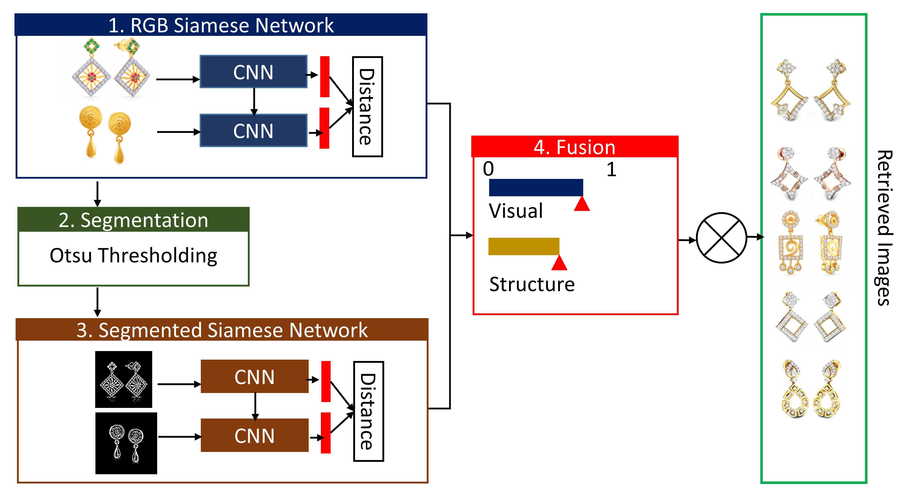

### Publication
DSSN: Dual Shallow Siamese Network for Fashion Image Retrieval, 
By : Sk Maidul Islam, Subhankar Joardar, and Arif Ahmed Sekh
In: Consideration

[Link to The Paper](https:xxxx)

### Dataset Description
To be Added
### License

Copyright © 2022 Sk. Arif Ahmed

The content of this repository is bound by the following licenses:

- The documents and data are licensed under the MIT license.
